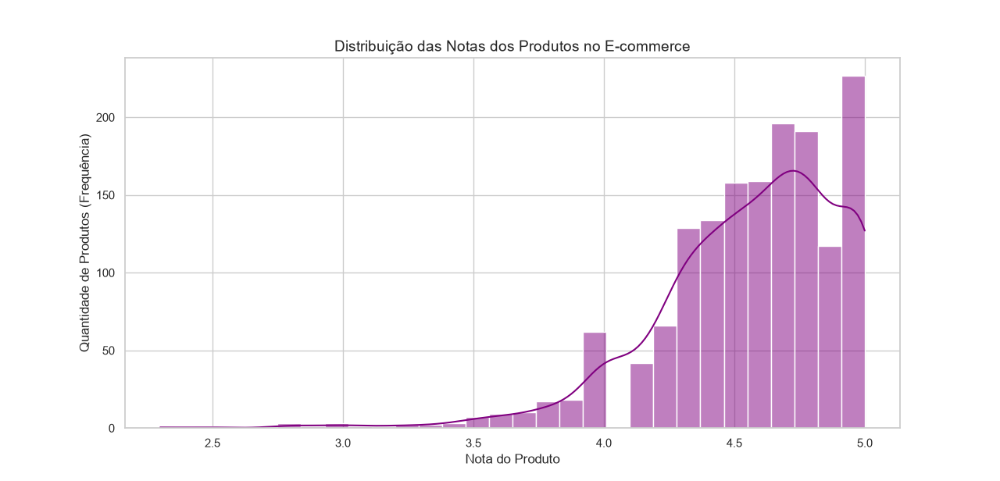
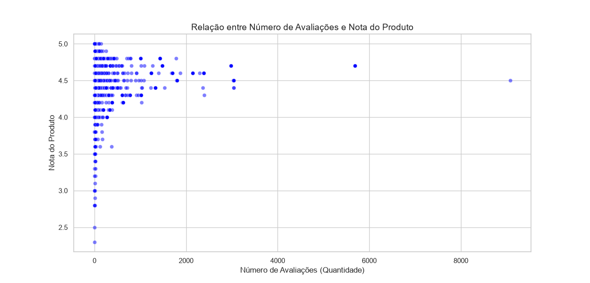
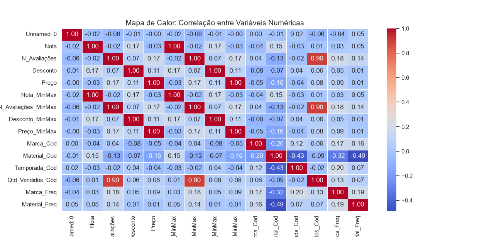
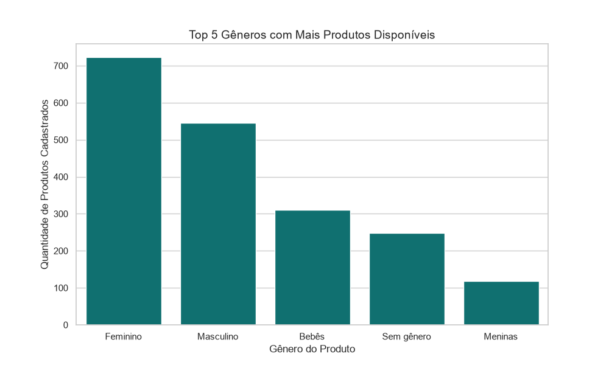
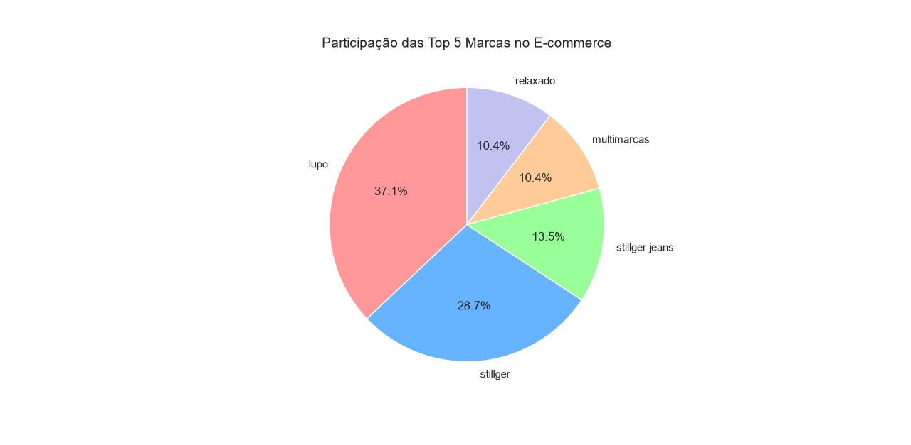
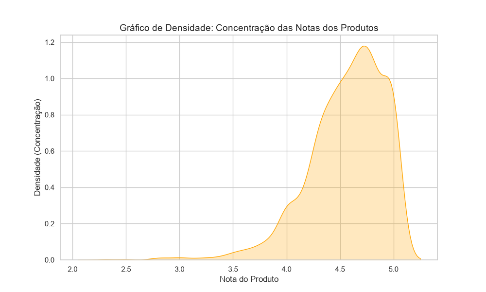
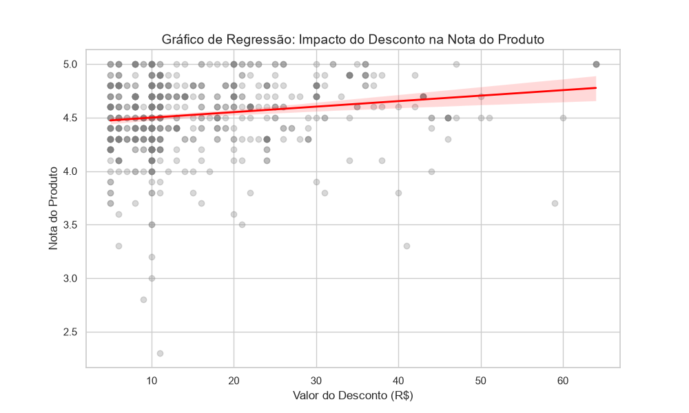

# 📊 Projeto: Análise de Dados de E-commerce

Este repositório contém o meu primeiro projeto prático desenvolvido no curso de Ciência de Dados da EBAC. 

O objetivo foi analisar uma base de dados de um e-commerce (`ecommerce_preparados.csv`) utilizando Python, Pandas, Matplotlib e Seaborn para extrair insights de negócios através da visualização de dados.

## 📈 Resultados da Análise

Abaixo estão as visualizações geradas durante o processo de Análise Exploratória de Dados (EDA):

### 1. Distribuição das Notas (Histograma)

### 2. Relação entre Avaliações e Notas (Dispersão)

### 3. Correlação entre Variáveis Numéricas (Mapa de Calor)

### 4. Top 5 Gêneros (Gráfico de Barras)

### 5. Participação das Marcas (Gráfico de Pizza)

### 6. Concentração das Notas (Densidade)

### 7. Impacto do Desconto nas Notas (Regressão)

